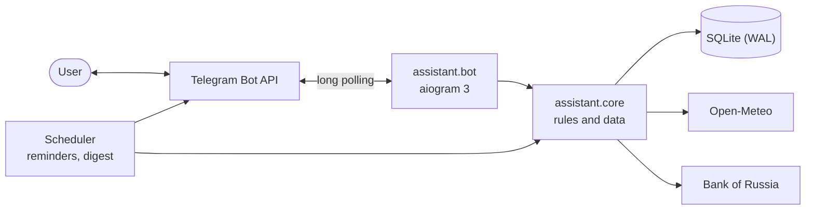

<p align="center">
  
</p>

<h1 align="center">Personal Assistant</h1>

<p align="center">
  A Telegram bot that doesn't just say “+12°C” — it says “🌧 Rain in 40 minutes, take an umbrella”.<br>
  Weather, reminders, notes, habits and exchange rates in one chat, and in the morning the bot writes first.
</p>

<p align="center">
  <a href="https://github.com/APELSINKos/personal-assistant-bot/actions/workflows/ci.yml"></a>
  
  
  <a href="LICENSE"></a>
  <a href="https://t.me/ikbo63_24_bot"></a>
</p>

<p align="center"><a href="README.md">Русский</a> · <b>English</b></p>

## Features

| | |
|---|---|
| 🌤 **Weather with tips** | Not just degrees: in how many minutes rain or snow starts, whether it gets colder by the evening, whether it's a good day for a bike ride |
| ☀️ **Morning digest** | The bot writes at the time you choose, in your city's time zone: weather, today's plans, habits, rates |
| 📅 **My day** | Everything important for today in one message |
| ⏰ **Reminders** | `18:30`, `25.09 18:30` or `25.09.2027 18:30`. If Telegram or the network fails, the bot tries again |
| 🎯 **Habits** | One-tap marks, streaks and a strip of the last 9 days |
| 📝 **Notes** | Short notes with a delete button next to each |
| 💱 **Bank of Russia rates** | USD and EUR with the daily change, a converter both ways |
| 🌐 **Two languages** | Russian and English: taken from Telegram, switchable in the settings |

```text
☀️ Good morning, Alex!
📅 Monday, September 28

🌡 Moscow: +6…+13°C
☔ Rain is expected after 18:00 — an umbrella will come in handy
🧥 Cold in the morning, warmer in the evening

📌 Today:
• 12:30 — meeting
• 19:00 — workout

🎯 Habits for today: 3 — don't forget to mark them
🔥 Best streak: “Sport” — 5 days
💵 84.20 ₽ · 💶 96.67 ₽
```

## How it works



- **The core knows nothing about Telegram.** Limits, habit streaks, time parsing and weather tips live in `assistant.core` and are covered by tests. The bot only parses input and formats replies; the same core will serve the Mini App.
- **Time without surprises.** Every moment is stored in UTC, "today" is computed in the city's time zone, DST transitions are handled.
- **Delivery with retries.** On 429 the bot waits exactly as long as Telegram asks; on network failures it retries after 30 s, 1 min, 5 min, 15 min, 1 h and 3 h; users who blocked the bot are left alone.
- **Dialogs in the database.** Unfinished input survives a restart, and a menu button pressed mid-dialog simply opens that section.
- **Automatic deploys.** After a green CI run a commit from `main` goes to the server; if the bot does not come up, the script restores the previous version and database.

More in [docs/ARCHITECTURE.md](docs/ARCHITECTURE.md) (Russian).

## Stack

Python 3.12 · aiogram 3 · SQLAlchemy 2 (async) · Alembic · SQLite · httpx · Fluent + Babel · pytest · ruff · mypy · uv · GitHub Actions · systemd

## Development

```bash
uv sync
uv run alembic upgrade head
uv run python -m assistant.bot
```

Settings come from environment variables or a `.env` file, see [.env.example](.env.example). Checks: `uv run pytest`, `uv run ruff check .`, `uv run mypy`. Details in [docs/DEVELOPMENT.md](docs/DEVELOPMENT.md) (Russian).

## Roadmap

- [x] **v1.0** — coursework edition
- [x] **v2.0** — new core, two languages, reliable delivery, CI and automatic deploys
- [ ] **v2.1** — Mini App: today, reminders, habits and notes inside Telegram
- [ ] **v2.2** — smart reminders: repeats, “+10 minutes”, natural input like “tomorrow at 9 buy milk”
- [ ] **v2.3** — habits: yearly heat map, goals, a shareable stats card
- [ ] **v2.4** — finances: expenses, budget, exchange rate charts
- [ ] **v2.5** — 7-day forecast, several cities, search and checklists in notes

## History

Version 1.0 (September 2026) was a coursework project for the “Software Testing, Verification and Validation” course at RTU MIREA; its materials are in [docs/coursework](docs/coursework) and its code is tagged [v1.0.0](https://github.com/APELSINKos/personal-assistant-bot/tree/v1.0.0). Since 2.0 it is the author's personal project.

## Author

Aleksandr Kovalev — [@APELSINKos](https://github.com/APELSINKos)

## License

[MIT](LICENSE)
