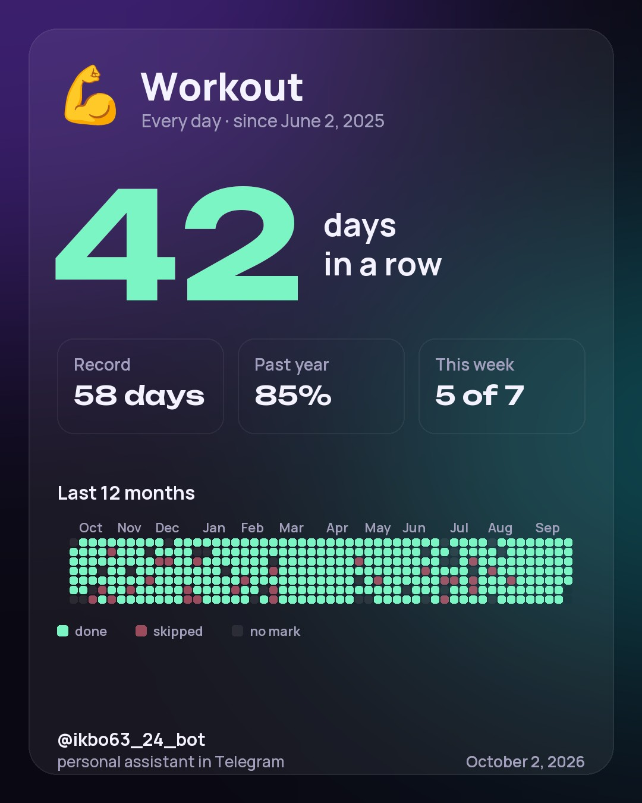
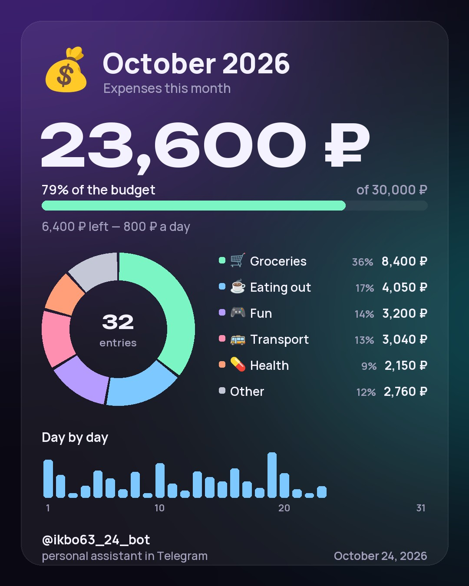

<p align="center">
  
</p>

<h1 align="center">Personal Assistant</h1>

<p align="center">
  A Telegram bot that doesn't just say “+12°C” — it says “🌧 Rain in 40 minutes, take an umbrella”.<br>
  Weather, reminders, class schedule, notes, habits and money — in the chat and in an app right inside Telegram, and in the morning the bot writes first.
</p>

<p align="center">
  <a href="https://github.com/APELSINKos/personal-assistant-bot/actions/workflows/ci.yml"></a>
  
  
  
  
  <a href="LICENSE"></a>
  <a href="https://t.me/ikbo63_24_bot"></a>
</p>

<p align="center"><a href="README.md">Русский</a> · <b>English</b></p>

## Features

| | |
|---|---|
| 📱 **Mini App** | The same inside Telegram as an app: a Today screen, the weather for a day and a week, a calendar with classes and reminders, one-tap habits, money with charts, notes with checklists and settings. Theme and language follow Telegram |
| 🌤 **Weather with tips** | Not just degrees: in how many minutes rain or snow starts, whether it gets colder by the evening, whether it's a good day for a bike ride. An hourly and a 7-day forecast in the same message, for your home city and four more, and the weather on the way to classes and back |
| ☀️ **Morning digest** | The bot writes at the time you choose, in your city's time zone: the weather now and for your classes, today's plans, habits, yesterday's spending, rates |
| 📅 **My day** | Everything important for today in one message — with your pinned notes, and in the evening with tomorrow's weather |
| ⏰ **Reminders** | Write like to a person: “tomorrow at 9 buy milk”, “in 20 minutes tea”, “on weekdays at 7:30 workout”. Repeats on weekdays, every other week or monthly — in your city's time zone; a delivered reminder has “+10 min”, “+1 h”, “Tomorrow”, “✓ Done” buttons |
| 🎓 **Class schedule** | A MIREA group by name, a link to any calendar (`webcal://`, `https://`) or an `.ics` file: classes and week numbers in the app's calendar, “My day” and the morning digest, refreshed every 6 hours, an optional alert 5–60 minutes before a class |
| 🎯 **Habits** | One-tap marks, a goal of every day or a few times a week, a streak and a record, the past year's percentage, a year map, your own emoji and color; a stats card to share in any chat |
| 📝 **Notes** | Checklists with checkboxes, search that ignores case (and ё/е in Russian), pinning what matters to the top; links are kept and open from the app. A message the bot didn't understand becomes a note with one “📝 Save as a note” button |
| 💰 **Money** | An expense is noted with one phrase right in the chat: “coffee 250”, “yesterday taxi 300”, “+5000 salary”. The category is guessed from a dictionary, and a corrected one is remembered. A monthly budget, total and per category, warns at 80% and 100%, the month's report comes as a picture, Bank of Russia rates — with a 30-day chart and a converter |
| 🌐 **Two languages** | Russian and English: taken from Telegram, switchable in the settings |

```text
☀️ Good morning, Alex!
📅 Monday, September 28

☁️ Moscow: +6°C, overcast · up to +13°C today
☔ Rain expected after 18:00 — an umbrella will come in handy
🧥 Cold in the morning, warmer in the evening
🎓 To classes (10:40): +10°C · after (14:10): +13°C
Weather data: open-meteo.com

📌 Today:
• 19:00 — workout
🎓 Classes · Week 5:
• 10:40–12:10 Calculus · A-16
• 12:40–14:10 Databases · Room 212

🎯 Habits for today: 3 — don't forget to mark them
🔥 Best streak: “Sport” — 5 days
💵 84.20 ₽ · 💶 96.67 ₽
[🕐 Hourly] [📅 Week]
```

```text
📅 Moscow — 7 days

Today 🌧 +6…+13°C 💧 80%
Tomorrow ☁️ +5…+11°C 💧 20%
Wed, 30 Sep 🌤 +4…+12°C
Thu, 1 Oct ☀️ +3…+12°C
Fri, 2 Oct 🌧 +6…+10°C 💧 70%
Sat, 3 Oct ☁️ +5…+9°C
Sun, 4 Oct 🌤 +2…+8°C

Weather data: open-meteo.com
[🌤 Now] [🕐 Hourly]
[🏠 Moscow] [Tula] [Sochi]
[🏙 Cities]
```

```text
🎯 Your habits (2/10):

1. 💪 Sport — 12 of 17 days 🔥
    🟩🟩🟥🟩🟩🟩🟩🟩⬜  streak: 5 days

2. 📚 Reading — this week 2 of 3 🔥
    ⬜🟩⬜🟩⬜⬜🟩🟩⬜  streak: 4 weeks

🟩 done · 🟥 skipped · ⬜ no mark — the last 9 days
```

<p align="center">
  
</p>

```text
You: on weekdays at 7:30 workout
Bot: ↻ on weekdays at 07:30 — workout
     First time: Tomorrow, 07:30
     [✅ Create] [🕘 Another time] [✖️ Cancel]
```

```text
📌 Shopping

⬜ milk
✅ bread
⬜ eggs
[⬜ milk]
[✅ bread]
[⬜ eggs]
[➕ Items] [🧹 Remove checked]
[📌 Unpin] [✏️ Edit]
[🗑 Delete] [↩️ To notes]
```

```text
You: coffee 250
Bot: ✅ ☕ Eating out — 250 ₽ · coffee
     October: 23,850 ₽ of 30,000 ₽
     [🗂 Category] [↩️ Undo]
```

<p align="center">
  
</p>

## Mini App

The Open button next to the message field opens the app right inside Telegram — the same account and the same data as the chat: what you add in the app shows up in the bot at once, and the other way round.

| Screen | What's there |
|---|---|
| **Today** | A big date, weather with tips (a tap opens the Weather screen), today's classes with the weather on the way and today's plans, one-tap habit marks, today's spending with the budget bar, pinned notes, rates and the best streak. Pull down to refresh |
| **Weather** | Chips for the cities — home and extra ones; now with the feels-like temperature, gusts, humidity and every tip, a 24-hour strip with a temperature curve, 7 days with range bars, sunrise and sunset |
| **Calendar** | A week strip with dots and the week number, a day heading “Today · Tuesday, 29 September”, the month on a tap; classes, reminders and repeats per day, editing and deleting, a new reminder from a phrase or the fields |
| **Habits** | A list with the week's progress and marks that cycle ⬜ → ✅ → ❌ as in the bot. Each habit has its own screen: the streak, the record, the past year's percentage, a year map (a week opens its month), marks for past days, the goal, emoji and color; Share sends the card to any chat |
| **Notes** | Search above the list, pinned notes on top, checklists with checkboxes and progress, links in the text open on a tap; an editor with a character counter, and leaving with unsaved text asks first |
| **Money** | The month with arrows: what is spent and what is left for each day, a ring by category (a tap shows the category's entries), spending day by day and every entry — a tap edits, a swipe deletes. A new entry, budgets, your own categories with emoji, any Bank of Russia currency over 30 days and a converter |
| **More** | Cities — the home one and up to four extra ones, the class schedule (a group, a link or a file, class alerts), the morning digest, language, currency, the data sources, version |

Dark and light themes follow Telegram, Back and the main button are Telegram's own buttons, and actions answer with haptics. The app only works inside Telegram: every request carries Telegram's signature, and the server checks it.

## How it works


- **Phrases without AI.** “tomorrow at 9”, “in 20 minutes”, “every other wednesday” are parsed by Russian and English rules with over a hundred table tests; nothing is created until you confirm the card.
- **Expenses without AI too.** “coffee 250” goes through rules and a dictionary of two hundred word stems, and the user's own memory knows where they moved entries before. Reminder phrases are parsed first, units and times (“2 liters”, “meeting at 9”) never become an expense, and every expense noted comes with an Undo button at once.
- **The core knows nothing about Telegram.** Limits, habit streaks, time parsing and weather tips live in `assistant.core` and are covered by tests. The bot only parses input and formats replies, and the app's API calls the same services — so the chat and the app follow the same rules.
- **The app is trusted only by signature.** The API lets a request reach any data only when its initData is signed by Telegram with the bot token and is less than a day old; the user comes from the signature, and someone else's id gets 404. The one exception is the card picture, which Telegram fetches itself by a token link (below). Errors are problem+json, at most 120 requests a minute.
- **A timetable from any calendar.** A MIREA group is found by name in a directory the server builds itself from the groups' calendars; a link or an `.ics` file goes through the same parser. Classes are expanded four months ahead and shown in your city's time zone; when the source is down, the last timetable stays, marked “data from …”.
- **One request for the forecast.** Open-Meteo gives everything for a city at once: the weather now, precipitation every 15 minutes, the week by the hour and by the day. Moments come as Unix seconds and are turned into the city's time zone, so the hour labels don't slip after the clocks go back. An answer is checked before it goes into a 10-minute cache; at most two requests run at once, a failure pauses them for a minute, and My day, the digest and Today still come without the weather.
- **A checklist in the chat and in the app.** Items are rows of their own in the database, so a check made in the chat and one made in the app never overwrite each other. An item's button does not toggle but sets the state it offers: a button of an old card never undoes a check made in the app. The notes search folds case and “ё” the same way in Python and TypeScript, and one table of cases tests both sides.
- **Pictures are drawn on the server.** Pillow draws the habit card, the month's report and the 30-day rates — 1080×1350 JPEGs from fonts and emoji kept in the repository, so the same data gives the same picture on any machine. A habit card shared from the app is fetched by Telegram by a link with a random 256-bit token; it is kept while Telegram may ask for it, but no longer than 7 days, at most 10 cards per user. At most 6 pictures a minute per user.
- **The app's charts are its own.** The category ring, the day bars, the rate line and the temperature curve are SVG without libraries; each chart has a label for screen readers, and its numbers are in the legend and the lists too.
- **Links never lead inside the server.** A calendar link is downloaded from public addresses only: the server resolves the name itself, checks every address and every redirect and connects to the checked IP — up to 2 MB and 10 seconds, at most three calendar downloads or parses a minute per user (in the bot and in the app separately). On top of that, the systemd services cannot reach private, link-local or CGNAT (`100.64.0.0/10`) networks (loopback stays open).
- **Time without surprises.** Every moment is stored in UTC, "today" is computed in the city's time zone, DST transitions are handled.
- **Delivery with retries.** On 429 the bot waits exactly as long as Telegram asks; on network failures it retries after 30 s, 1 min, 5 min, 15 min, 1 h and 3 h; users who blocked the bot are left alone.
- **Dialogs in the database.** Unfinished input survives a restart, and a menu button pressed mid-dialog simply opens that section.
- **Automatic deploys.** After a green CI run a commit from `main` goes to the server. The app is built while the previous version keeps running; if the bot or the API does not come up, the script restores the previous code, database and app build.

More in [docs/ARCHITECTURE.md](docs/ARCHITECTURE.md) (Russian).

## Stack

Python 3.12 · aiogram 3 · FastAPI · SQLAlchemy 2 (async) · Alembic · SQLite · httpx · icalendar · Pillow · Fluent + Babel · React 19 · TypeScript · Vite · TanStack Query · pytest · Vitest · ruff · ESLint · mypy · uv · Caddy · GitHub Actions · systemd

## Development

```bash
uv sync
uv run alembic upgrade head
uv run python -m assistant.bot      # the bot
uv run python -m assistant.api      # the app's API, 127.0.0.1:8000
cd webapp && npm ci && npm run dev  # the app in a browser
```

Settings come from environment variables or a `.env` file, see [.env.example](.env.example). To open the app in an ordinary browser you need signed initData: `scripts/dev_init_data.py` prints it using a test bot's token. Checks: `uv run pytest`, `uv run ruff check .`, `uv run mypy`; for the app — `npm run lint`, `npm run typecheck`, `npm test`. Details in [docs/DEVELOPMENT.md](docs/DEVELOPMENT.md) (Russian).

## Roadmap

- [x] **v1.0** — coursework edition
- [x] **v2.0** — new core, two languages, reliable delivery, CI and automatic deploys
- [x] **v2.1** — Mini App: today, reminders, habits, notes and settings inside Telegram
- [x] **v2.2** — smart reminders: repeats, “+10 minutes”, phrase input, a calendar in the app
- [x] **v2.3** — class schedule: a MIREA group, a calendar link or file
- [x] **v2.4** — habits: a year map, goals, a shareable stats card
- [x] **v2.5** — finances: expenses, budget, exchange rate charts
- [x] **v2.6** — 7-day forecast, several cities, search and checklists in notes
- [ ] **v2.7** — showcase: screenshots, a demo and a project cover

## History

Version 1.0 (September 2026) was a coursework project for the “Software Testing, Verification and Validation” course at RTU MIREA; its materials are in [docs/coursework](docs/coursework) and its code is tagged [v1.0.0](https://github.com/APELSINKos/personal-assistant-bot/tree/v1.0.0). Since 2.0 it is the author's personal project.

## Author

Aleksandr Kovalev — [@APELSINKos](https://github.com/APELSINKos)

## Data and licences

- **Weather** — [Open-Meteo](https://open-meteo.com/), licence [CC BY 4.0](https://creativecommons.org/licenses/by/4.0/). The bot and the app round the data and add tips to it; the line “Weather data: open-meteo.com” stands next to the weather in every message and on every screen that shows it.
- **City names** — [GeoNames](https://www.geonames.org/) through Open-Meteo's city search, licence [CC BY 4.0](https://creativecommons.org/licenses/by/4.0/).

Both sources and the licence are in the bot itself too — in `/start` and `/help` — and in the app, under More → Data.

## License

[MIT](LICENSE)
