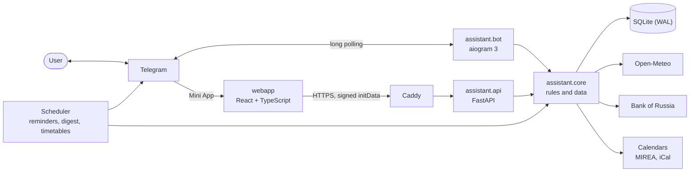

<p align="center">
  
</p>

<h1 align="center">Personal Assistant</h1>

<p align="center">
  A Telegram bot that doesn't just say “+12°C” — it says “🌧 Rain in 40 minutes, take an umbrella”.<br>
  Weather, reminders, class schedule, notes, habits and exchange rates — in the chat and in an app right inside Telegram, and in the morning the bot writes first.
</p>

<p align="center">
  <a href="https://github.com/APELSINKos/personal-assistant-bot/actions/workflows/ci.yml"></a>
  
  
  
  
  <a href="LICENSE"></a>
  <a href="https://t.me/ikbo63_24_bot"></a>
</p>

<p align="center"><a href="README.md">Русский</a> · <b>English</b></p>

## Features

| | |
|---|---|
| 📱 **Mini App** | The same inside Telegram as an app: a Today screen, a calendar with classes and reminders, one-tap habits, notes and settings. Theme and language follow Telegram |
| 🌤 **Weather with tips** | Not just degrees: in how many minutes rain or snow starts, whether it gets colder by the evening, whether it's a good day for a bike ride |
| ☀️ **Morning digest** | The bot writes at the time you choose, in your city's time zone: weather, today's plans, habits, rates |
| 📅 **My day** | Everything important for today in one message |
| ⏰ **Reminders** | Write like to a person: “tomorrow at 9 buy milk”, “in 20 minutes tea”, “on weekdays at 7:30 workout”. Repeats on weekdays, every other week or monthly — in your city's time zone; a delivered reminder has “+10 min”, “+1 h”, “Tomorrow”, “✓ Done” buttons |
| 🎓 **Class schedule** | A MIREA group by name, a link to any calendar (`webcal://`, `https://`) or an `.ics` file: classes and week numbers in the app's calendar, “My day” and the morning digest, refreshed every 6 hours, an optional alert 5–60 minutes before a class |
| 🎯 **Habits** | One-tap marks, streaks and a strip of the last 9 days |
| 📝 **Notes** | Short notes with a delete button next to each |
| 💱 **Bank of Russia rates** | USD and EUR with the daily change, a converter both ways |
| 🌐 **Two languages** | Russian and English: taken from Telegram, switchable in the settings |

```text
☀️ Good morning, Alex!
📅 Monday, September 28

🌡 Moscow: +6…+13°C
☔ Rain is expected after 18:00 — an umbrella will come in handy
🧥 Cold in the morning, warmer in the evening

📌 Today:
• 19:00 — workout
🎓 Classes · Week 5:
• 10:40–12:10 Calculus · A-16
• 12:40–14:10 Databases · Room 212

🎯 Habits for today: 3 — don't forget to mark them
🔥 Best streak: “Sport” — 5 days
💵 84.20 ₽ · 💶 96.67 ₽
```

```text
You: on weekdays at 7:30 workout
Bot: ↻ on weekdays at 07:30 — workout
     First time: Tomorrow, 07:30
     [✅ Create] [🕘 Another time] [✖️ Cancel]
```

## Mini App

The Open button next to the message field opens the app right inside Telegram — the same account and the same data as the chat: what you add in the app shows up in the bot at once, and the other way round.

| Screen | What's there |
|---|---|
| **Today** | A big date, weather with tips, today's classes and plans, one-tap habit marks, rates and the best streak. Pull down to refresh |
| **Calendar** | A week strip with dots and the week number, a day heading “Today · Tuesday, 29 September”, the month on a tap; classes, reminders and repeats per day, editing and deleting, a new reminder from a phrase or the fields |
| **Habits** | Streak, progress and a 9-day strip; marks cycle ⬜ → ✅ → ❌ as in the bot |
| **Notes** | A list and an editor with a character counter; leaving with unsaved text asks first |
| **More** | City search, the class schedule (a group, a link or a file, class alerts), the morning digest, language, version |

Dark and light themes follow Telegram, Back and the main button are Telegram's own buttons, and actions answer with haptics. The app only works inside Telegram: every request carries Telegram's signature, and the server checks it.

## How it works



- **Phrases without AI.** “tomorrow at 9”, “in 20 minutes”, “every other wednesday” are parsed by Russian and English rules with over a hundred table tests; nothing is created until you confirm the card.
- **The core knows nothing about Telegram.** Limits, habit streaks, time parsing and weather tips live in `assistant.core` and are covered by tests. The bot only parses input and formats replies, and the app's API calls the same services — so the chat and the app follow the same rules.
- **The app is trusted only by signature.** The API accepts a request only when its initData is signed by Telegram with the bot token and is less than a day old; the user comes from the signature, and someone else's id gets 404. Errors are problem+json, at most 120 requests a minute.
- **A timetable from any calendar.** A MIREA group is found by name in a directory the server builds itself from the groups' calendars; a link or an `.ics` file goes through the same parser. Classes are expanded four months ahead and shown in your city's time zone; when the source is down, the last timetable stays, marked “data from …”.
- **Links never lead inside the server.** A calendar link is downloaded from public addresses only: the server resolves the name itself, checks every address and every redirect and connects to the checked IP — up to 2 MB and 10 seconds. On top of that, the systemd services cannot reach private or link-local networks (loopback stays open).
- **Time without surprises.** Every moment is stored in UTC, "today" is computed in the city's time zone, DST transitions are handled.
- **Delivery with retries.** On 429 the bot waits exactly as long as Telegram asks; on network failures it retries after 30 s, 1 min, 5 min, 15 min, 1 h and 3 h; users who blocked the bot are left alone.
- **Dialogs in the database.** Unfinished input survives a restart, and a menu button pressed mid-dialog simply opens that section.
- **Automatic deploys.** After a green CI run a commit from `main` goes to the server. The app is built while the previous version keeps running; if the bot or the API does not come up, the script restores the previous code, database and app build.

More in [docs/ARCHITECTURE.md](docs/ARCHITECTURE.md) (Russian).

## Stack

Python 3.12 · aiogram 3 · FastAPI · SQLAlchemy 2 (async) · Alembic · SQLite · httpx · icalendar · Fluent + Babel · React 19 · TypeScript · Vite · TanStack Query · pytest · Vitest · ruff · ESLint · mypy · uv · Caddy · GitHub Actions · systemd

## Development

```bash
uv sync
uv run alembic upgrade head
uv run python -m assistant.bot      # the bot
uv run python -m assistant.api      # the app's API, 127.0.0.1:8000
cd webapp && npm ci && npm run dev  # the app in a browser
```

Settings come from environment variables or a `.env` file, see [.env.example](.env.example). To open the app in an ordinary browser you need signed initData: `scripts/dev_init_data.py` prints it using a test bot's token. Checks: `uv run pytest`, `uv run ruff check .`, `uv run mypy`; for the app — `npm run lint`, `npm run typecheck`, `npm test`. Details in [docs/DEVELOPMENT.md](docs/DEVELOPMENT.md) (Russian).

## Roadmap

- [x] **v1.0** — coursework edition
- [x] **v2.0** — new core, two languages, reliable delivery, CI and automatic deploys
- [x] **v2.1** — Mini App: today, reminders, habits, notes and settings inside Telegram
- [x] **v2.2** — smart reminders: repeats, “+10 minutes”, phrase input, a calendar in the app
- [x] **v2.3** — class schedule: a MIREA group, a calendar link or file
- [ ] **v2.4** — habits: yearly heat map, goals, a shareable stats card
- [ ] **v2.5** — finances: expenses, budget, exchange rate charts
- [ ] **v2.6** — 7-day forecast, several cities, search and checklists in notes
- [ ] **v2.7** — showcase: screenshots, a demo and a project cover

## History

Version 1.0 (September 2026) was a coursework project for the “Software Testing, Verification and Validation” course at RTU MIREA; its materials are in [docs/coursework](docs/coursework) and its code is tagged [v1.0.0](https://github.com/APELSINKos/personal-assistant-bot/tree/v1.0.0). Since 2.0 it is the author's personal project.

## Author

Aleksandr Kovalev — [@APELSINKos](https://github.com/APELSINKos)

## License

[MIT](LICENSE)
