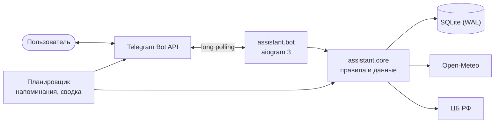

<p align="center">
  
</p>

<h1 align="center">Личный помощник</h1>

<p align="center">
  Telegram-бот, который не просто скажет «+12°C», а напишет «🌧 Через 40 минут дождь — возьми зонт».<br>
  Погода, напоминания, заметки, привычки и курсы валют в одном чате, а по утрам бот пишет первым.
</p>

<p align="center">
  <a href="https://github.com/APELSINKos/personal-assistant-bot/actions/workflows/ci.yml"></a>
  
  
  <a href="LICENSE"></a>
  <a href="https://t.me/ikbo63_24_bot"></a>
</p>

<p align="center"><b>Русский</b> · <a href="README.en.md">English</a></p>

## Что умеет

| | |
|---|---|
| 🌤 **Погода с советами** | Не только градусы: через сколько минут начнётся дождь или снег, похолодает ли к вечеру, нужен ли шарф, хороший ли день для велосипеда |
| ☀️ **Утренняя сводка** | Бот сам пишет в выбранное время по часовому поясу вашего города: погода, дела на сегодня, привычки, курсы |
| 📅 **Мой день** | Всё важное на сегодня одним сообщением |
| ⏰ **Напоминания** | `18:30`, `25.09 18:30` или `25.09.2027 18:30`. Если Telegram или сеть подвели, бот повторит попытку |
| 🎯 **Привычки** | Отметка в одно касание, серии дней и полоса за последние 9 дней |
| 📝 **Заметки** | Короткие записи с удалением кнопкой |
| 💱 **Курсы ЦБ РФ** | Доллар и евро с изменением за день, конвертер в обе стороны |
| 🌐 **Два языка** | Русский и английский: язык берётся из Telegram и меняется в настройках |

```text
☀️ Доброе утро, Саша!
📅 28 сентября, понедельник

🌡 Москва: +6…+13°C
☔ Дождь ожидается после 18:00 — зонт сегодня пригодится
🧥 Утром холодно, вечером потеплеет

📌 Сегодня:
• 12:30 — встреча
• 19:00 — тренировка

🎯 Привычек на сегодня: 3 — не забудь отметить
🔥 Лучшая серия: «Спорт» — 5 дней
💵 84,20 ₽ · 💶 96,67 ₽
```

```text
🎯 Твои привычки (1/10):

1. Спорт — 12 из 17 дней 🔥
    🟩🟩🟥🟩🟩🟩🟩🟩⬜  серия: 5 дней

🟩 выполнено · 🟥 пропущено · ⬜ без отметки — последние 9 дней
```

## Как устроено



- **Ядро отдельно от Telegram.** Правила — лимиты, серии привычек, разбор времени, советы погоды — живут в `assistant.core` и покрыты тестами. Бот только разбирает ввод и оформляет ответы; это же ядро будет обслуживать Mini App.
- **Время без сюрпризов.** Все моменты хранятся в UTC, «сегодня» считается по часовому поясу города, переходы на летнее время учтены.
- **Доставка с повторами.** При ответе 429 бот ждёт столько, сколько попросил Telegram; при сбое сети повторяет через 30 с, 1 мин, 5 мин, 15 мин и 1 ч; тех, кто заблокировал бота, не беспокоит.
- **Диалоги в базе.** Незаконченный ввод переживает перезапуск, а кнопка меню посреди ввода просто открывает раздел.
- **Автодеплой.** После зелёного CI коммит из `main` уходит на сервер; если бот не поднялся, скрипт возвращает прежнюю версию и базу.

Подробнее — в [docs/ARCHITECTURE.md](docs/ARCHITECTURE.md).

## Стек

Python 3.12 · aiogram 3 · SQLAlchemy 2 (async) · Alembic · SQLite · httpx · Fluent + Babel · pytest · ruff · mypy · uv · GitHub Actions · systemd

## Запуск для разработки

```bash
uv sync
uv run alembic upgrade head
uv run python -m assistant.bot
```

Настройки читаются из переменных окружения или файла `.env`, список — в [.env.example](.env.example). Проверки: `uv run pytest`, `uv run ruff check .`, `uv run mypy`. Подробнее — в [docs/DEVELOPMENT.md](docs/DEVELOPMENT.md).

## Дорожная карта

- [x] **v1.0** — учебная версия
- [x] **v2.0** — новое ядро, два языка, надёжная доставка, CI и автодеплой
- [ ] **v2.1** — Mini App: «Сегодня», напоминания, привычки и заметки внутри Telegram
- [ ] **v2.2** — умные напоминания: повторы, «+10 минут», ввод фразой «завтра в 9 купить молоко»
- [ ] **v2.3** — привычки: тепловая карта за год, цели, карточка со статистикой
- [ ] **v2.4** — финансы: расходы, бюджет, графики курсов
- [ ] **v2.5** — погода на неделю, несколько городов, поиск и чек-листы в заметках

## Документация

- [Архитектура](docs/ARCHITECTURE.md)
- [Разработка](docs/DEVELOPMENT.md)
- [Развёртывание](docs/DEPLOY.md)
- [Руководство пользователя](docs/USER_GUIDE.md)
- [История изменений](CHANGELOG.md)

## История

Версия 1.0 (сентябрь 2026) — учебный проект по дисциплине «Тестирование, верификация и валидация ПО» в РТУ МИРЭА; её материалы собраны в [docs/coursework](docs/coursework), код — под тегом [v1.0.0](https://github.com/APELSINKos/personal-assistant-bot/tree/v1.0.0). С версии 2.0 это личный проект автора.

## Автор

Александр Ковалев — [@APELSINKos](https://github.com/APELSINKos)

## Лицензия

[MIT](LICENSE)
