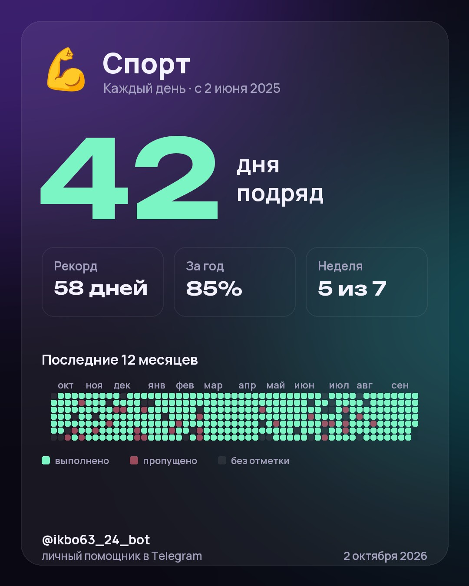
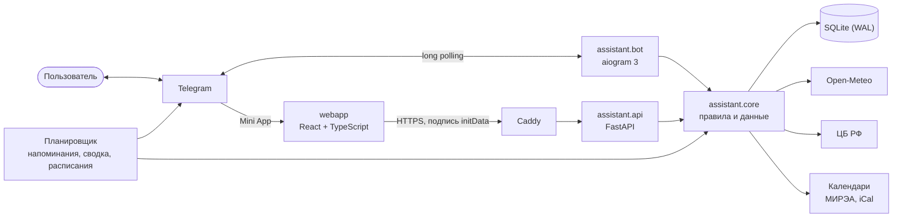

<p align="center">
  
</p>

<h1 align="center">Личный помощник</h1>

<p align="center">
  Telegram-бот, который не просто скажет «+12°C», а напишет «🌧 Через 40 минут дождь — возьми зонт».<br>
  Погода, напоминания, расписание пар, заметки, привычки и курсы валют — в чате и в приложении прямо внутри Telegram, а по утрам бот пишет первым.
</p>

<p align="center">
  <a href="https://github.com/APELSINKos/personal-assistant-bot/actions/workflows/ci.yml"></a>
  
  
  
  
  <a href="LICENSE"></a>
  <a href="https://t.me/ikbo63_24_bot"></a>
</p>

<p align="center"><b>Русский</b> · <a href="README.en.md">English</a></p>

## Что умеет

| | |
|---|---|
| 📱 **Mini App** | Всё то же в приложении внутри Telegram: экран «Сегодня», календарь с парами и напоминаниями, привычки в одно касание, заметки и настройки. Тема и язык — как в Telegram |
| 🌤 **Погода с советами** | Не только градусы: через сколько минут начнётся дождь или снег, похолодает ли к вечеру, нужен ли шарф, хороший ли день для велосипеда |
| ☀️ **Утренняя сводка** | Бот сам пишет в выбранное время по часовому поясу вашего города: погода, дела на сегодня, привычки, курсы |
| 📅 **Мой день** | Всё важное на сегодня одним сообщением |
| ⏰ **Напоминания** | Пишите как человеку: «завтра в 9 купить молоко», «через 20 минут чай», «по будням в 7:30 зарядка». Повторы по дням недели, раз в две недели и раз в месяц — по поясу вашего города; в пришедшем напоминании кнопки «+10 мин», «+1 ч», «Завтра», «✓ Готово» |
| 🎓 **Расписание пар** | Группа МИРЭА по названию, ссылка на любой календарь (`webcal://`, `https://`) или файл `.ics`: пары и номер недели в календаре приложения, «Моём дне» и утренней сводке, обновление само каждые 6 часов, напоминание за 5–60 минут до пары — по желанию |
| 🎯 **Привычки** | Отметка в одно касание, цель — каждый день или несколько раз в неделю, серия и рекорд, процент за год, карта года, свои эмодзи и цвет; карточкой со статистикой можно поделиться в любом чате |
| 📝 **Заметки** | Короткие записи с удалением кнопкой |
| 💱 **Курсы ЦБ РФ** | Доллар и евро с изменением за день, конвертер в обе стороны |
| 🌐 **Два языка** | Русский и английский: язык берётся из Telegram и меняется в настройках |

```text
☀️ Доброе утро, Саша!
📅 28 сентября, понедельник

🌡 Москва: +6…+13°C
☔ Дождь ожидается после 18:00 — зонт сегодня пригодится
🧥 Утром холодно, вечером потеплеет

📌 Сегодня:
• 19:00 — тренировка
🎓 Пары · 5 неделя:
• 10:40–12:10 ЛК Математический анализ · А-16
• 12:40–14:10 ПР Разработка баз данных · И-212-б

🎯 Привычек на сегодня: 3 — не забудь отметить
🔥 Лучшая серия: «Спорт» — 5 дней
💵 84,20 ₽ · 💶 96,67 ₽
```

```text
🎯 Твои привычки (2/10):

1. 💪 Спорт — 12 из 17 дней 🔥
    🟩🟩🟥🟩🟩🟩🟩🟩⬜  серия: 5 дней

2. 📚 Чтение — на этой неделе 2 из 3 🔥
    ⬜🟩⬜🟩⬜⬜🟩🟩⬜  серия: 4 недели

🟩 выполнено · 🟥 пропущено · ⬜ без отметки — последние 9 дней
```

<p align="center">
  
</p>

```text
Ты: по будням в 7:30 зарядка
Бот: ↻ по будням в 07:30 — зарядка
     Первый раз: Завтра, 07:30
     [✅ Создать] [🕘 Другое время] [✖️ Отмена]
```

## Mini App

Кнопка «Открыть» у поля ввода открывает приложение прямо в Telegram — тот же аккаунт и те же данные, что в чате: добавленное в приложении сразу видно в боте, и наоборот.

| Экран | Что там |
|---|---|
| **Сегодня** | Большая дата, погода с советами, пары и дела на сегодня, привычки с отметкой в одно касание, курсы и лучшая серия. Потяните вниз — данные обновятся |
| **Календарь** | Неделя полосой с точками и номером недели, подпись дня «Сегодня · вторник, 29 сентября», месяц по тапу; пары, напоминания и повторы по дням, правка и удаление, новое напоминание фразой или по полям |
| **Привычки** | Список с прогрессом недели и отметкой по кругу ⬜ → ✅ → ❌, как в боте. У каждой привычки свой экран: серия, рекорд, процент за год, карта года (неделя открывает свой месяц), отметки за прошлые дни, цель, эмодзи и цвет; «Поделиться» отправляет карточку в любой чат |
| **Заметки** | Список и редактор со счётчиком символов; перед выходом с несохранённым текстом приложение спросит |
| **Ещё** | Город с поиском, расписание пар (группа, ссылка или файл, напоминания о парах), утренняя сводка, язык, версия |

Тёмная и светлая тема повторяют Telegram, «Назад» и главная кнопка — родные кнопки Telegram, действия отзываются вибрацией. Приложение работает только внутри Telegram: каждый запрос несёт подпись Telegram, и сервер её проверяет.

## Как устроено



- **Фразы без ИИ.** Разбор «завтра в 9», «через 20 минут», «раз в две недели по средам» — набор правил на русском и английском с сотней с лишним табличных тестов; бот ничего не создаёт, пока вы не подтвердите карточку.
- **Ядро отдельно от Telegram.** Правила — лимиты, серии привычек, разбор времени, советы погоды — живут в `assistant.core` и покрыты тестами. Бот только разбирает ввод и оформляет ответы, API приложения вызывает те же сервисы — поэтому правила в чате и в приложении одни и те же.
- **Приложению верят только по подписи.** API принимает запрос, только если initData подписана Telegram токеном бота и не старше суток; пользователь берётся из подписи, чужой id — 404. Ошибки — в формате problem+json, не больше 120 запросов в минуту.
- **Расписание из любого календаря.** Группа МИРЭА ищется по названию в справочнике, который сервер сам собирает по календарям групп; ссылка или файл `.ics` разбираются тем же кодом. Пары разворачиваются на четыре месяца вперёд и показываются по поясу вашего города; если источник недоступен, остаётся прежнее расписание с пометкой «данные от …».
- **Карточка рисуется на сервере.** Pillow рисует JPEG 1080×1350 из шрифтов и эмодзи, которые лежат в репозитории, поэтому бот и приложение показывают одну и ту же картинку. Telegram забирает её по ссылке со случайным 256-битным токеном; карточка хранится, пока Telegram может её запросить, но не дольше 7 дней, у пользователя — не больше 10 карточек и не больше 6 новых в минуту.
- **Ссылки не ведут внутрь сервера.** Календарь по ссылке скачивается только с публичных адресов: сервер сам разрешает имя, проверяет каждый адрес и каждый редирект и подключается к проверенному IP — до 2 МБ и 10 секунд, не больше трёх скачиваний или разборов календаря в минуту на пользователя (в боте и в приложении отдельно). Вдобавок службам systemd закрыты частные сети, адреса link-local и CGNAT `100.64.0.0/10` (loopback остаётся открытым).
- **Время без сюрпризов.** Все моменты хранятся в UTC, «сегодня» считается по часовому поясу города, переходы на летнее время учтены.
- **Доставка с повторами.** При ответе 429 бот ждёт столько, сколько попросил Telegram; при сбое сети повторяет через 30 с, 1 мин, 5 мин, 15 мин, 1 ч и 3 ч; тех, кто заблокировал бота, не беспокоит.
- **Диалоги в базе.** Незаконченный ввод переживает перезапуск, а кнопка меню посреди ввода просто открывает раздел.
- **Автодеплой.** После зелёного CI коммит из `main` уходит на сервер. Приложение собирается, пока работает прежняя версия; если бот или API не поднялись, скрипт возвращает прежний код, базу и сборку приложения.

Подробнее — в [docs/ARCHITECTURE.md](docs/ARCHITECTURE.md).

## Стек

Python 3.12 · aiogram 3 · FastAPI · SQLAlchemy 2 (async) · Alembic · SQLite · httpx · icalendar · Pillow · Fluent + Babel · React 19 · TypeScript · Vite · TanStack Query · pytest · Vitest · ruff · ESLint · mypy · uv · Caddy · GitHub Actions · systemd

## Запуск для разработки

```bash
uv sync
uv run alembic upgrade head
uv run python -m assistant.bot      # бот
uv run python -m assistant.api      # API для приложения, 127.0.0.1:8000
cd webapp && npm ci && npm run dev  # приложение в браузере
```

Настройки читаются из переменных окружения или файла `.env`, список — в [.env.example](.env.example). Чтобы открыть приложение в обычном браузере, нужна подписанная initData: её печатает `scripts/dev_init_data.py` токеном тестового бота. Проверки: `uv run pytest`, `uv run ruff check .`, `uv run mypy`; для приложения — `npm run lint`, `npm run typecheck`, `npm test`. Подробнее — в [docs/DEVELOPMENT.md](docs/DEVELOPMENT.md).

## Дорожная карта

- [x] **v1.0** — учебная версия
- [x] **v2.0** — новое ядро, два языка, надёжная доставка, CI и автодеплой
- [x] **v2.1** — Mini App: «Сегодня», напоминания, привычки, заметки и настройки внутри Telegram
- [x] **v2.2** — умные напоминания: повторы, «+10 минут», ввод фразой, календарь в приложении
- [x] **v2.3** — расписание пар: группа МИРЭА, ссылка или файл календаря
- [x] **v2.4** — привычки: карта года, цели, карточка со статистикой
- [ ] **v2.5** — финансы: расходы, бюджет, графики курсов
- [ ] **v2.6** — погода на неделю, несколько городов, поиск и чек-листы в заметках
- [ ] **v2.7** — витрина: скриншоты, демо и обложка проекта

## Документация

- [Архитектура](docs/ARCHITECTURE.md)
- [Разработка](docs/DEVELOPMENT.md)
- [Развёртывание](docs/DEPLOY.md)
- [Руководство пользователя](docs/USER_GUIDE.md)
- [История изменений](CHANGELOG.md)

## История

Версия 1.0 (сентябрь 2026) — учебный проект по дисциплине «Тестирование, верификация и валидация ПО» в РТУ МИРЭА; её материалы собраны в [docs/coursework](docs/coursework), код — под тегом [v1.0.0](https://github.com/APELSINKos/personal-assistant-bot/tree/v1.0.0). С версии 2.0 это личный проект автора.

## Автор

Александр Ковалев — [@APELSINKos](https://github.com/APELSINKos)

## Лицензия

[MIT](LICENSE)
